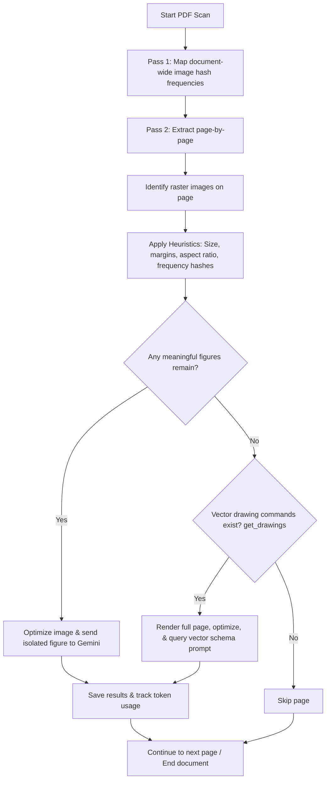

# PaperVision: Asynchronous PDF Figure Extraction API

PaperVision is a production-grade backend REST API service designed to extract structured information and text from meaningful figures in research paper PDFs using Python, FastAPI, PyMuPDF, Pillow, and Google's Gemini Vision API.

The service implements a hybrid extraction pipeline to target both **embedded raster figures** and **vector graphics rendered from PDF drawing commands**, while programmatically filtering out margins, publisher logos, tiny affiliation icons, decorative lines, and repeated brand watermarks.

---

## Key Features

- **Asynchronous Background Processing**: Multipart uploads immediately return a `job_id`, deferring visual extraction and LLM calls to a self-contained, thread-safe background FIFO task queue (`asyncio.Queue`).
- **Precision Noise Heuristics**:
  - *Size Filters*: Automatically discards image layers below custom dimensions.
  - *Aspect Ratio Limits*: Excludes horizontal border lines and vertical dividers.
  - *Margin Exclusion*: Filters out page headers and footers using top/bottom percentages.
  - *Document deduplication*: Builds a global SHA-256 hash map of all images first, instantly ignoring publisher branding, repeated icons, or watermarks appearing on multiple pages.
- **Asynchronous Vector Fallback**: Full-page fallback rendering (150 DPI) triggered only when no raster figures exist on a page but vector paths (`page.get_drawings()`) are detected.
- **Structured JSON Schema Output**: Guarantees perfectly structured JSON models matching specified figure categories (charts, graphs, tables, diagrams, equations) using Gemini's structured output mode.
- **Detailed Token Logging**: Captures `promptTokenCount`, `candidatesTokenCount`, and `totalTokenCount` directly from Gemini metadata and logs usage stats per figure.
- **Production Code Organization**: Standard async boundaries, clean type hints, Pydantic data validators, and environment configurations via `pydantic-settings`.

---

## Project Structure

```
app/
  api/
    router.py           # REST endpoints (/extract, /status, /result)
  services/
    pdf_service.py      # Core orchestrator pipeline (raster vs vector fallback)
  extractors/
    raster.py           # PyMuPDF image extractor & noise filters
    vector.py           # page.get_drawings vector detector
  llm/
    gemini_client.py    # Dedicated Gemini Vision client with structured schema logging
  models/
    schemas.py          # Pydantic schemas for requests, responses, and LLM JSON
  utils/
    helpers.py          # LANCZOS image optimization & SHA-256 calculators
  workers/
    task_queue.py       # Asynchronous FIFO queue & background task loop daemon
  storage/
    job_store.py        # In-memory async-safe job state storage
  config.py             # Settings manager using pydantic-settings
  main.py               # FastAPI lifecycle context and server setup
requirements.txt        # Dependencies manifest
.env.example            # Environment variables template
.env                    # Live local configuration
```

---

## Installation & Setup

1. **Clone or copy the directory** to your workspace.
2. **Install the dependencies**:
   ```bash
   pip3 install -r requirements.txt
   ```
3. **Configure your environment variables**:
   Copy `.env.example` to `.env` and fill in your Google Gemini API key:
   ```bash
   cp .env.example .env
   ```
   Open `.env` and set `GEMINI_API_KEY`:
   ```env
   GEMINI_API_KEY="your_api_key_here"
   GEMINI_MODEL="gemini-2.5-flash"
   ```

---

## Running the Application

Start the FastAPI application using `uvicorn`:
```bash
uvicorn app.main:app --host 0.0.0.0 --port 8000 --reload
```

- **Interactive API Documentation (Swagger)**: Visit `http://localhost:8000/docs` (or standard redirect `http://localhost:8000/`).
- **Interactive ReDoc**: Visit `http://localhost:8000/redoc`.

---

## Endpoint Usage Guide

### 1. Submit a research paper PDF (`POST /extract`)
Upload your PDF document to start an extraction job.
```bash
curl -X POST "http://localhost:8000/extract" \
  -H "accept: application/json" \
  -H "Content-Type: multipart/form-data" \
  -F "file=@/path/to/your/research_paper.pdf"
```

**Response**:
```json
{
  "job_id": "848fb6a5-78e2-45e0-b6f7-11116c4c9e47",
  "status": "queued"
}
```

### 2. Check Job Status (`GET /status/{job_id}`)
Query progress: returning `queued`, `processing`, `completed`, or `failed`.
```bash
curl "http://localhost:8000/status/848fb6a5-78e2-45e0-b6f7-11116c4c9e47"
```

**Response**:
```json
{
  "job_id": "848fb6a5-78e2-45e0-b6f7-11116c4c9e47",
  "status": "processing"
}
```

### 3. Retrieve Figure Extraction Results (`GET /result/{job_id}`)
Obtain the final array of extracted figures, LaTeX mappings, structures, and token usages.
```bash
curl "http://localhost:8000/result/848fb6a5-78e2-45e0-b6f7-11116c4c9e47"
```

**Response**:
```json
{
  "job_id": "848fb6a5-78e2-45e0-b6f7-11116c4c9e47",
  "status": "completed",
  "figures": [
    {
      "page": 3,
      "figure_index": 1,
      "figure_type": "chart",
      "extraction_method": "raster",
      "structured_text": {
        "confidence": 0.98,
        "reasoning": "Bar chart illustrating performance comparison.",
        "title": "Normalized Accuracy Metrics",
        "x_axis": "Method Name (ResNet, ViT)",
        "y_axis": "Accuracy (%)",
        "legends": ["Dataset A", "Dataset B"]
      },
      "token_usage": {
        "prompt": 1412,
        "completion": 284,
        "total": 1696
      }
    }
  ]
}
```

---

## Pipeline Logic Details


